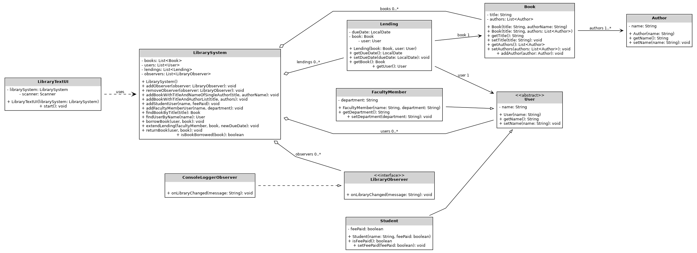

# Library Management System

A text-based library management system written in Java.  
The project demonstrates Maven, JUnit testing, UML design, refactoring, packaging and the Observer design pattern.

## Features

- Add books
- Add student users
- Add faculty member users
- Find books by title
- Find users by name
- Borrow books
- Return books
- View all books
- View all users
- View all active lendings
- Observer notifications for library events

## Technologies Used

- Java
- Maven
- JUnit 5

## Project Structure

- `model` - domain classes such as `Book`, `User` and `Lending`
- `service` - core business logic in `LibrarySystem`
- `observer` - Observer pattern interfaces and implementations
- `ui` - text-based user interface
- `exception` - custom exception classes

## Maven Goals

The project supports the following Maven goals:

- `mvn compile`
- `mvn test`
- `mvn exec:java`
- `mvn package`
- `mvn site`

## UML

## How to Run

### Run with Maven

mvn compile
mvn exec:java
mvn test